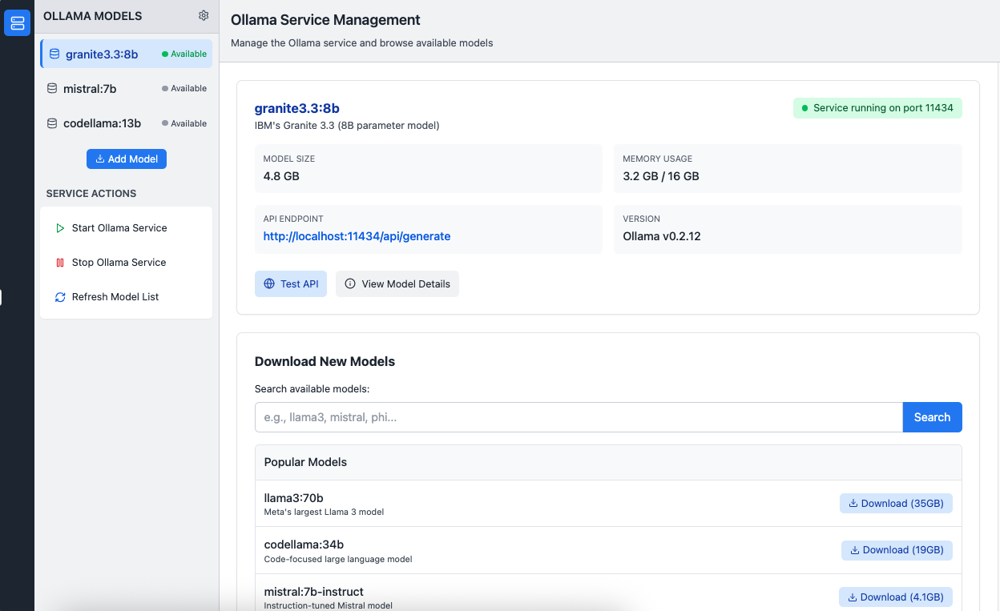

# Model Management [Draft for ideation]



## Core Components

### 1. Service Manager
- **Primary Function**: Control Ollama service lifecycle (start/stop)
- **Status Monitoring**: Track service running state and health
- **Port Management**: Monitor service on port 11434
- **Service Information**: Display Ollama version (v0.2.12)

### 2. Model Manager
- **Model Discovery**: Browse available models from registry
- **Local Model Display**: Show downloaded models with "Available" status
- **Model Operations**: Download, view details, and manage models
- **Model Metadata**: Track size, parameters, and descriptions

### 3. API Gateway
- **Endpoint Management**: Expose API at http://localhost:11434/api/generate
- **Connection Testing**: Verify API accessibility
- **Health Monitoring**: Check service responsiveness
- **Request Routing**: Handle API communication

### 4. UI Controller
- **Sidebar Management**: Display model list and service actions
- **Main Panel**: Show model details and download interface
- **Status Bar**: Present service status and port information
- **Event Handling**: Process user interactions

## High-Level Design

### Architecture Pattern
- **Service-Centric Design**: Focus on Ollama service rather than individual models
- **Unified Model State**: All models show "Available" status regardless of loading state
- **Centralized Control**: Single service controls all model operations
- **Real-time Monitoring**: Continuous service status updates

### Key Design Decisions
- **Service State**: Binary (Running/Stopped) instead of per-model states
- **Model Status**: Simplified to "Available" for all downloaded models
- **Control Granularity**: Service-level rather than model-level control
- **Status Display**: Prominent service state indicators

## Technical Architecture

### Backend Services

#### Service Management Layer
```
ServiceManager
├── startService()
├── stopService()
├── getServiceStatus()
├── monitorHealth()
└── getServiceInfo()
```

#### Model Management Layer
```
ModelManager
├── listAvailableModels()
├── downloadModel()
├── getModelMetadata()
├── refreshModelList()
└── getModelDetails()
```

#### API Layer
```
ApiClient
├── testConnection()
├── getEndpointInfo()
├── checkHealth()
├── makeRequest()
└── handleResponse()
```

### Frontend Architecture

#### VS Code Integration
```
Extension
├── TreeView Provider (Sidebar)
├── WebView Panel (Main Content)
├── Status Bar Provider
├── Command Palette
└── Configuration Handler
```

#### Component Structure
```
Main Component
├── Activity Bar (Server Icon)
├── Sidebar
│   ├── Model List
│   └── Service Actions Panel
├── Main Content
│   ├── Model Details Panel
│   └── Download Section
└── Status Bar
```

## User Workflow

### Service Management Flow
```
1. User opens VS Code with Ollama extension
   ├── Extension checks service status
   └── Displays current state in sidebar

2. Start Service
   ├── User clicks "Start Ollama Service"
   ├── Service launches on port 11434
   ├── Status updates to "Running"
   └── Models become accessible

3. Stop Service
   ├── User clicks "Stop Ollama Service"
   ├── Service shuts down
   ├── Status updates to "Stopped"
   └── Models become unavailable
```

### Model Management Flow
```
1. Browse Models
   ├── View available downloaded models
   ├── See "Available" status for all
   └── Select model for details

2. Download Models
   ├── Click "Add Model"
   ├── Search in registry
   ├── Select from popular models
   ├── Monitor download progress
   └── Model appears in list

3. Model Operations
   ├── View model details
   ├── Check API endpoint
   ├── Test model connection
   └── Access model metadata
```

### API Integration Flow
```
1. Service Connection
   ├── Service running on localhost:11434
   ├── API endpoint at /api/generate
   └── Health check available

2. API Testing
   ├── User clicks "Test API"
   ├── Extension sends health request
   ├── Results displayed
   └── Status updated

3. Model Interaction
   ├── Models accessible via API
   ├── Endpoint remains constant
   ├── Request routing handled automatically
   └── Response processing managed
```

## Key Architectural Decisions

### Service-Level Abstraction
- **Rationale**: Ollama manages model loading internally
- **Benefit**: Simplified user mental model
- **Implementation**: Single service state instead of multiple model states

### Unified Model Status
- **Rationale**: All downloaded models are accessible when service runs
- **Benefit**: Consistent user experience
- **Implementation**: "Available" status for all local models

### API Standardization
- **Rationale**: Single endpoint for all model interactions
- **Benefit**: Simplified integration for developers
- **Implementation**: Fixed endpoint at localhost:11434/api/generate

### Real-time Status Monitoring
- **Rationale**: Users need immediate feedback
- **Benefit**: Clear system state awareness
- **Implementation**: Status bar and sidebar indicators

## Data Flow

### Service Status Flow
```
Service Process → Monitor → Service Manager → UI Controller → Status Display
```

### Model Data Flow
```
Ollama Registry → Download Manager → Local Storage → Model Manager → UI Display
```

### API Communication Flow
```
VS Code → API Client → Service Endpoint → Ollama → Response → UI Update
```

## Integration Points

### VS Code Extension API
- **TreeView**: Model listing and actions
- **WebView**: Detailed interfaces
- **StatusBar**: Service status display
- **Commands**: Service control actions

### Ollama Service
- **CLI Interface**: Service management
- **REST API**: Model operations
- **File System**: Model storage
- **Process Management**: Service lifecycle

### User Interface
- **Activity Bar**: Extension activation
- **Sidebar**: Primary controls
- **Main Panel**: Detailed operations
- **Status Bar**: Quick status view

