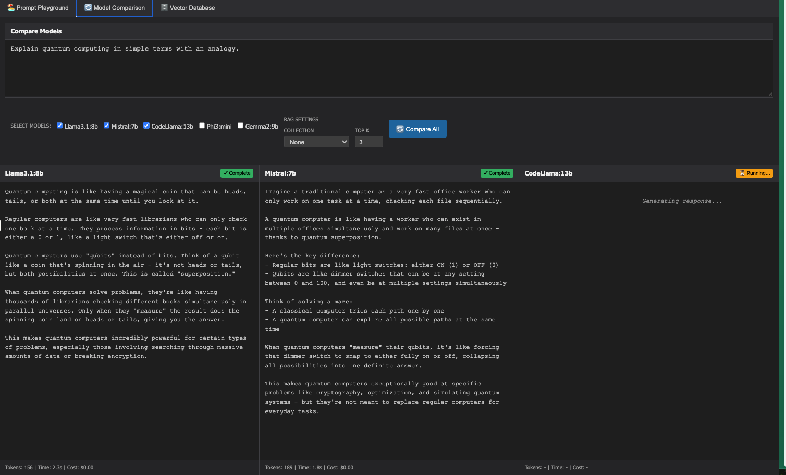

# High Level Capabilities needed for Prompt Development and Management locally

**Prompt Registry:**

* **Visual Prompt Template Creation:** Offers a user-friendly, no-code visual dashboard to create and edit prompt templates. This allows both technical and non-technical team members to contribute to prompt engineering.
* **Versioning:** Enables the tracking and management of different versions of prompts. Users can view changes, compare versions (diff), add notes and comments, and roll back to previous versions.
* **Organization:** Provides features to organize prompts using folders and snippets, preventing prompts from being scattered throughout the codebase.
* **Programmatic Retrieval:** Allows developers to retrieve specific prompt templates and versions directly within their code using the PromptLayer API.
* **Input Variables:** Supports the creation of dynamic prompts using input variables that can be filled at runtime. Different string parsing methods like f-strings and Jinja2 are supported.
* **Release Labels:** Enables the management of prompts across different environments (e.g., production, staging) by applying release labels to specific versions.

**Prompt Iteration & Testing:**

* **Interactive Prompt Testing:** Offers a playground environment where users can test prompts against different models and parameters.
* **Model Comparison:** Enables testing the same prompts across different LLM models to compare their outputs.

