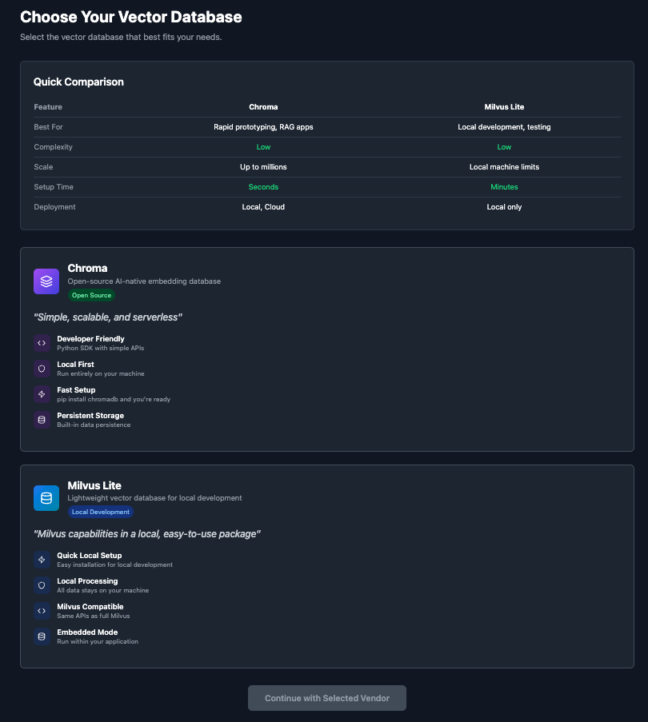

# Vector DB Assistant [Concept for Ideation]
## Main flow
## Wireframe


## Vector DB Assistant


### Create New Database


### Vendor Selection


### Chroma local connection pane


### Review Configuration


## Data Source Management Interface


### Configure Sources


### Source Detailed View


### Preview and Verify


### Chunking strategy 


### Process Documents


## Chat with Vector Database


# VS Code Vector DB Extension - High-Level Architecture & Design [Draft concept for Ideation]

## Overview
This document outlines the high-level architecture and design for a VS Code extension that provides vector database management, data source integration, and AI-powered chat functionality for semantic search and document interaction.

## Architecture Principles
- **Modular Design**: Separation of concerns between UI, business logic, and data access
- **Extensibility**: Support for multiple vector databases and LLM providers
- **Performance**: Asynchronous operations to maintain VS Code responsiveness
- **Security**: Secure storage for API keys and sensitive configuration
- **User Experience**: Intuitive interface following VS Code design patterns

## Frontend Architecture

### 1. Extension Entry Point
- **Main Activation**: Extension activates on VS Code startup or first use
- **Command Registration**: Register commands for all major features
- **Context Menus**: Integration with VS Code's context menus
- **Status Bar**: Show connection status and quick actions

### 2. UI Components Structure

#### 2.1 Main Panel (Webview Panel)
```
├── Header Component
│   ├── Title Bar
│   └── Global Actions
├── Navigation Sidebar
│   ├── Vector Databases View
│   ├── Data Sources View
│   └── Chat Interface View
└── Content Area
    ├── Overview Grids
    ├── Detail Views
    └── Configuration Forms
```

#### 2.2 Component Hierarchy
- **BaseComponent**: Abstract component with common functionality
- **PanelView**: Container for main sections
- **ListComponent**: Reusable list/grid component
- **FormComponent**: Configuration forms
- **ModalComponent**: Dialog boxes and wizards
- **ChatComponent**: Chat interface with message history

### 3. State Management
- **Global State**: Application-level configuration and preferences
- **Database State**: Active connections, schemas, and metadata
- **UI State**: View states, selections, and temporary data
- **Chat State**: Messages, conversation history, and contexts

## Backend Architecture

### 1. Core Services

#### 1.1 Database Management Service
```
├── Connection Manager
│   ├── Chroma Adapter
│   ├── Milvus Adapter
│   ├── Pinecone Adapter
│   └── Qdrant Adapter
├── Schema Manager
├── Index Manager
└── Vector Operations
```

#### 1.2 Data Source Service
```
├── File System Handler
├── Web Scraper
├── Document Parser
├── Chunking Engine
└── Embedding Generator
```

#### 1.3 Chat Service
```
├── LLM Integration
│   ├── Ollama Client
│   ├── OpenAI Client
│   └── Anthropic Client
├── Context Manager
├── Retrieval Augmentation
└── Message History
```

### 2. Data Layer

#### 2.1 Configuration Management
- **VS Code Settings**: User preferences and global configuration
- **Workspace Settings**: Project-specific configurations
- **Secret Storage**: Encrypted storage for API keys
- **Cache Management**: Temporary data and performance optimization

#### 2.2 Persistence Layer
- **Database Connections**: Persistent connections to vector databases
- **Metadata Storage**: Source configurations and processing history
- **Chat History**: Conversation persistence
- **Index Cache**: Cached vector data for performance

### 3. Integration Layer

#### 3.1 Vector Database Adapters
```typescript
interface VectorDatabaseAdapter {
  connect(config: ConnectionConfig): Promise<Connection>
  createCollection(params: CollectionParams): Promise<Collection>
  upsertVectors(vectors: Vector[]): Promise<void>
  search(query: SearchQuery): Promise<SearchResult[]>
  delete(ids: string[]): Promise<void>
}
```

#### 3.2 LLM Adapters
```typescript
interface LLMAdapter {
  generateCompletion(prompt: string): Promise<string>
  generateEmbedding(text: string): Promise<number[]>
  streamCompletion(prompt: string): AsyncIterator<string>
}
```

## System Flow Diagrams

### 1. Database Creation Flow
```
User Action → UI Component → Command Handler → Database Service → Vector DB API
    ↓
Configuration Store ← Adapter → Response Handler ← Status Update
    ↓
UI Update ← State Manager ← Success/Error Handling
```

### 2. Data Source Processing Flow
```
Source Selection → File Handler → Document Parser → Chunking Engine
    ↓
Embedding Service → Vector Database → Index Update → Progress Notification
    ↓
UI Update ← Metadata Store ← Processing Complete
```

### 3. Chat Interaction Flow
```
User Query → Chat Component → Context Retrieval → Vector Search
    ↓
LLM Service → Response Generation → Message History → UI Update
    ↓
Context Enhancement ← RAG Pipeline ← Search Results
```

## Key Design Patterns

### 1. Command Pattern
- All user actions implemented as commands
- Centralized command registry
- Undo/redo functionality support

### 2. Observer Pattern
- Event-driven communication between components
- Status updates and progress notifications
- Real-time UI updates

### 3. Factory Pattern
- Dynamic creation of database adapters
- Plugin-like architecture for extensibility
- Configuration-based component instantiation

### 4. Repository Pattern
- Abstract data access layer
- Consistent interface for different storage types
- Easy testing and mocking

## Security Considerations

### 1. API Key Management
- Use VS Code's SecretStorage API
- Encrypt sensitive configuration data
- Avoid logging API keys or credentials

### 2. Data Privacy
- Local processing for sensitive documents
- Configurable data retention policies
- User consent for external API calls

### 3. Network Security
- Validate all external connections
- Implement connection timeouts
- Use secure protocols (HTTPS, WSS)

## Performance Optimizations

### 1. Lazy Loading
- Load components and data on demand
- Paginated results for large datasets
- Progressive enhancement

### 2. Caching Strategy
- Cache frequently accessed data
- Implement cache invalidation
- Memory management for large vectors

### 3. Background Processing
- Use worker threads for heavy operations
- Non-blocking UI operations
- Progress indicators for long tasks

## Extensibility Points

### 1. Plugin Architecture
- Support for custom vector databases
- Custom data source handlers
- Plugin API for third-party integrations

### 2. Configuration Schema
- Extensible configuration format
- Custom chunking strategies
- User-defined templates

### 3. Event System
- Hooks for custom processing
- Middleware pattern for transformations
- Custom UI components

